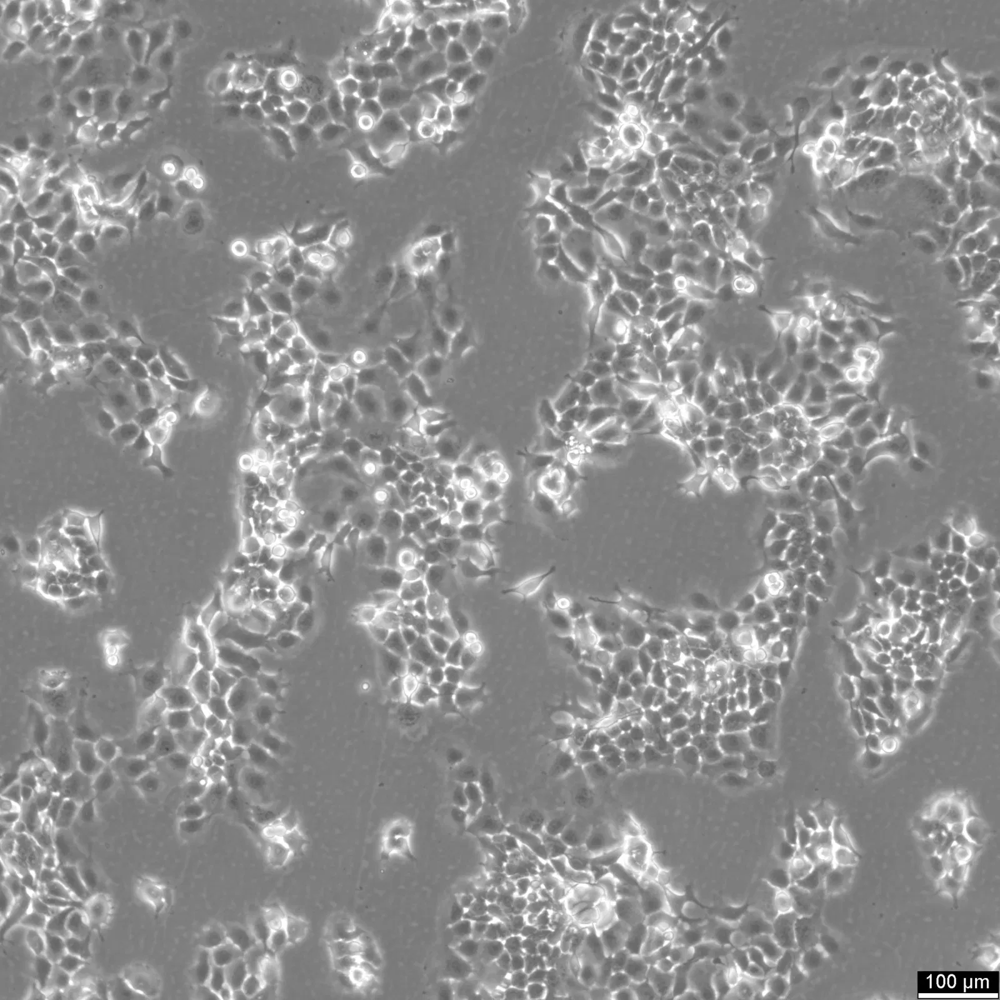

# **Transcriptomics**

## Información general:

Bitácora de trabajo durante el periodo agosto 2025-enero 2026.

**Objetivo:** diseñar e implentar el flujos de trabajo bioinformáticos para el análsis de datos transcriptómicos. 

+ Contacto: Biol.Exp. Raúl Valderrama: jhonatanraulm@gmail.com

---

## Índice

- [General](#información-general)
- [Recursos computacionales](#recursos-computacionales-bmf-lab)
- [ST: Lung](#spatial-transcriptomics-lung)
- [RNAseq bulk](#rnaseq-fadu)
- [Variantes](#variantes)
- [Pendientes](#pendientes)
- [Spatial transcriptomics](#spatial-transcriptomics:)
- [Literatura](#literatura)

---

### **Recursos computacionales BMF-LAB:**

| Recurso          | Detalle                                  | Implicación práctica                                    |
| ---------------- | ---------------------------------------- | ------------------------------------------------------- |
| CPU              | 16 núcleos / 32 hilos, i9-14900K, 64-bit | Muy potente, ideal para multitarea y análisis paralelos |
| RAM              | 62 GiB                                   | Suficiente para datasets grandes y simulaciones         |
| Swap             | 16 GiB                                   | Backup de memoria, no se usa mucho                      |
| Almacenamiento   | 1 TiB HDD virtual                        | Espacio suficiente, I/O limitado                        |
| GPU              | Basic Render Driver (sin aceleración)    | No hay GPU dedicada, no se puede usar CUDA/OpenCL       |
| Virtualización   | VT-x                                     | Puedes correr VMs                                       |
| Vulnerabilidades | Mayoría mitigadas                        | Sistema seguro                                          |

¿Hay GPU en windows que no este viendo por suar WSL?

    nvidia-smi
    lspci | grep -i vga
    wsl --gpu

Transferencia de archivos:

Desde laptop a la computadora del laboratorio:

    scp archivo.txt usuario_lab@IP_lab:/home/usuario_lab/

Desde la computadora del laboratorio a tu laptop:

    scp usuario_lab@IP_lab:/home/usuario_lab/archivo.txt ~/

Comando para matar procesos y procesos derivados:

    kill -TERM $(pstree -p 2496 | grep -oP '\d+' )

**Nota: ambos comandos se deben correr desde el equipo local no desde el servidor.**

---

### Spatial Transcriptomics: Lung 

> Septiembre 1, 2025

**Objetivo general: montar un flujo de trabajo para el análisis de datos transcriptómicos espaciales.**

+ Entragable 1: proporciones celulares, para mostrar en EUA.

Lectura y análisis del artículo [Spatial transcriptomics identifies molecular niche dysregulation associated with distal lung remodeling in pulmonary fibrosis](https://www.nature.com/articles/s41588-025-02080-x), para el trabajo de Miguel. 

Por hacer: 

+ Los datos estan libres? 
+ Qué plataforma se utiliza? XENIUM
+ Construir un set de datos de prueba, útiles para testear en flujo de trabajo.
+ Cómo funciona Xenium? Consideraciones de la segmentación? Complejidad del clustering. 
+ Qué es un TMA?

> Septiembre 29, 2025.

**¿Cómo innicio a montar un flujo de trabajo para datos Xenium?**

Recursos educativos de Xenium:

+ Xenium Onboard Analysis: https://www.10xgenomics.com/support/software/xenium-onboard-analysis/latest
+ Overview of Xenium Algorithms: https://www.10xgenomics.com/support/software/xenium-onboard-analysis/latest/algorithms-overview/xoa-algorithms
+ Xenium Explorer: https://www.10xgenomics.com/support/software/xenium-explorer/latest
+ Explore Human Breast Tumors: https://www.10xgenomics.com/products/xenium-in-situ/human-breast-dataset-explorer
+ R or Python: https://www.10xgenomics.com/analysis-guides/choosing-r-or-python-xenium-analysis-blog

**Tecnologías de transcriptómica espacial**

| Plataforma          | Fundamento / Método                          | Resolución        | Cobertura / Modalidades                    | Ventajas                                                                | Desventajas / Limitaciones            | Compatibilidad de muestras        |
|---------------------|-----------------------------------------------|-------------------|--------------------------------------------|-------------------------------------------------------------------------|----------------------------------------|-----------------------------------|
| **Chromium (10x)**  | Microgotas para captura de células/núcleos individuales (scRNA-seq, multiome) | Single cell       | Transcriptoma completo, TCR/BCR, ATAC, CRISPR | Descubrimiento global no sesgado, alta sensibilidad, multi-ómicas       | Sin información espacial (no contexto tisular) | Suspensiones celulares o núcleos (fresh, frozen, FFPE) |
| **Visium (10x)**    | Captura de RNA sobre spots (~55 µm)          | 1–10 células/spot | Transcriptoma completo, proteínas (Visium CytAssist) | Descubrimiento global con contexto espacial, integración con histología | Resolución multicelular, spots grandes | Fresh frozen, FFPE, fixed frozen |
| **Xenium (10x)**    | Hibridación in situ + imagen                 | Subcelular        | Panel dirigido (100s–1000s genes)          | Alta sensibilidad, precisión subcelular, integración con scRNA-seq/Visium | Limitado a panel, costo alto           | FFPE, fresh frozen               |

---

| Plataforma          | When to use (Cuándo usar)                                | Why use (Por qué usar)                                | Applications (Aplicaciones)                                   | Resolution (Resolución) | Data readout (Lectura de datos) | Sample compatibility (Muestras) |
|---------------------|----------------------------------------------------------|--------------------------------------------------------|---------------------------------------------------------------|--------------------------|----------------------------------|----------------------------------|
| **Chromium (Single Cell)** | Comprehensive single cell data. Ideal para caracterizar poblaciones y estados celulares en profundidad. | Unbiased single cell discovery. High per-gene sensitivity. | Whole transcriptome gene expression, Protein, TCR, BCR, CRISPR, ATAC | Single cell             | NGS-based                        | Suspensiones de células o núcleos (fresh, frozen, FFPE) |
| **Xenium (Spatial)** | Single cell spatial discovery. Validación y estudio dirigido con resolución subcelular. | High per-gene sensitivity. Precisión espacial subcelular. | Targeted gene expression (hasta ~5,000 genes). Multiomic gene + protein expression (480 genes + 27 proteínas) | Subcellular             | Imaging-based                    | FFPE, fresh frozen |
| **Visium (Spatial)** | Expanded spatial discovery. Entender tejidos complejos, vecindarios y comunicación célula a célula. | Whole transcriptome discovery. Integración con histología y multi-ómicas. | Whole transcriptome gene expression. Spatial protein expression. | Single cell–scale (spots ~55 µm → 1–10 células) | NGS-based                        | FFPE, fresh frozen, fixed frozen |

---

**Tipos de muestras de tejido**

| Tipo de muestra        | Método de preparación                      | Ventajas                                           | Desventajas / Limitaciones                       | Usos comunes                           |
|------------------------|--------------------------------------------|----------------------------------------------------|-------------------------------------------------|----------------------------------------|
| **FFPE tissue**        | Fijación en formalina + inclusión en parafina | Conservación a largo plazo, estándar clínico       | RNA fragmentado, menor sensibilidad              | Patología, biobancos, validación        |
| **Fresh frozen tissue**| Congelación inmediata (–80 °C o nitrógeno)   | Alta calidad de RNA, preserva proteínas y metabolitos | Requiere cadena de frío, menos práctico          | Transcriptómica, proteómica, metabolómica |
| **Tissue microarray (TMA)** | Cilindros de tejido múltiples re-ensamblados en un bloque | Procesa muchas muestras a la vez, eficiente        | Representa solo una parte → riesgo de sesgo      | Estudios de validación en cohortes grandes |

---

**Diferencias entre las tecnologías de 10x en transcriptómica espacial:**

| Category              | Chromium Single Cell platform                             | Xenium Spatial platform                                                                                          | Visium Spatial platform              |
|-----------------------|------------------------------------------------------------------------------------------------|------------------------------------------------------------------------------------------------------------------|---------------------------------------|
| **When to use**       | Comprehensive single cell data Ideal for deep characterization of cell populations and states. | High-resolution discovery Understand complex tissues, neighborhoods, and cell-to-cell interactions. Integration with other spatial-omics, histology, and morphology. | Expanded spatial discovery            |
| **Why use**           | Unbiased single cell discovery High per-gene sensitivity                                    | Single cell spatial discovery High per-gene sensitivity                                                       | Expanded spatial discovery            |
| **Applications**      | Whole transcriptome gene expression Protein TCR, BCR CRISPR ATAC                  | Targeted gene expression (up to 5,000 genes) Multiomic gene and protein expression (up to 480 genes and 27 proteins) | Whole transcriptome gene expression   |
| **Resolution**        | Single cell                                                                                    | Subcellular                                                                                                      | Single cell–scale                     |
| **Data readout**      | NGS-based                                                                                      | Imaging-based                                                                                                    | NGS-based                             |
| **Sample compatibility** | Single cell or nuclei suspensions from fresh, frozen, or FFPE samples                        | Fresh frozen FFPE                                                                                             | FFPE Fresh frozen Fixed frozen  |

---

**Tipos de muestras compatibles para ST:**

| Tipo de muestra | Descripción                                                                 | Ventajas                                                                                         | Desventajas                                                                 | Idoneidad en transcriptómica |
|-----------------|-----------------------------------------------------------------------------|-------------------------------------------------------------------------------------------------|------------------------------------------------------------------------------|-------------------------------|
| **FFPE** (Formalin-Fixed Paraffin-Embedded) | Tejido fijado en formalina e incrustado en parafina. Conservación a largo plazo. | - Excelente preservación morfológica - Amplia disponibilidad en biobancos - Compatible con IHC y algunas técnicas moleculares | - Fragmentación y degradación del ARN - Artefactos por fijación - Sensibilidad reducida en NGS | **Limitada** (ARN degradado, solo paneles dirigidos o 3’ RNA-seq adaptados) |
| **FFT** (Fresh Frozen Tissue) | Tejido congelado inmediatamente tras la resección quirúrgica. | - Conserva ácidos nucleicos y proteínas en estado casi nativo - Ideal para transcriptómica, proteómica y metabolómica | - Requiere cadena de frío (−80°C) - Costoso almacenamiento - Morfología menos preservada que FFPE | **Óptima** (mejor calidad e integridad del ARN, ideal para RNA-seq de alta resolución) |
| **TMA** (Tissue Microarray) | Técnica que agrupa múltiples cilindros de tejido en un solo bloque. | - Permite análisis de alto rendimiento - Eficiente en consumo de reactivos - Comparabilidad entre muestras | - Muestra limitada por cilindro - Riesgo de no representar la heterogeneidad tumoral - Depende de calidad del bloque original | **Muy limitada** (no apta para transcriptómica completa; solo aplicable si proviene de FFPE o FFT) |

---

Estas con algunas consideraciones importantes para el pre-procesamiento de los datos Xenium:

+ Normalización por tamaño de biblioteca (library size).
+ Log-transformación (opcional si se mantiene scaling).
+ Scaling (esencial).
+ PCA con todos los componentes.
+ Grafo kNN (16 vecinos).
+ Clustering Louvain o Leiden.
+ HVF selection: Opcional, porque el panel ya es pequeño y dirigido. Su omisión no rompe el clustering si scaling y normalización se mantienen.

**Parámetros críticos: Normalización, scaling, número de PCs, vecinos en kNN.**
**Fllujo de trabajo:**

                  ┌─────────────────────────────┐
                  │  Datos Xenium: Imagen +     │
                  │  Reads (FFPE o Fresh Frozen)│
                  └─────────────┬──────────────┘
                                │
                                ▼
                  ┌─────────────────────────────┐
                  │  Segmentación de células    │
                  │  1. Detectar núcleos → Cellpose
                  │  2. Asignar reads → Baysor │
                  │  (Sin expansión necesaria) │
                  └─────────────┬──────────────┘
                                │
                 ┌──────────────▼───────────────┐
                 │ Matriz célula × gen          │
                 │ (similar a scRNA-seq)        │
                 └──────────────┬───────────────┘
                                │
                 ┌──────────────▼───────────────┐
                 │ Identificación de tipos      │
                 │ celulares:                   │
                 │ - Filtrado de células        │
                 │ - Log-transformación         │
                 │ - Normalización              │
                 │ - PCA / Reducción de dim.    │
                 │ - Clustering (Louvain)       │
                 └──────────────┬───────────────┘
                                │
                 ┌──────────────▼───────────────┐
                 │ Detección de genes espaciales│
                 │ (SVFs) usando Squidpy,       │
                 │ SpatialDE, Hotspot, etc.     │
                 └──────────────┬───────────────┘
                                │
                 ┌──────────────▼───────────────┐
                 │ Imputación de genes (opcional)│
                 │ Usar scRNA-seq de referencia │
                 │ Algoritmos: SpaGE, Tangram,  │
                 │ Seurat                       │
                 └──────────────┬───────────────┘
                                │
                 ┌──────────────▼───────────────┐
                 │ Identificación de dominios   │
                 │ tisulares:                   │
                 │ - Métodos simples: binning   │
                 │ - Métodos avanzados: Banksy, │
                 │   SPACEL                     │
                 └───────────────────────────  ─┘

> Octubre 6, 2025

El listado de proteínas proporcionado por Pablo tiene un traslape muy bajo contra le Panel de Inmunooncológico de Xenium y de los DEGs de tumores de pacientes FA:

+ Intersection between Xenium and RNA-seq:
    Number of genes in intersection: 39
    KLRD1, IL7R, NF1, MIS18BP1, HIF1A, KRAS, VEGFA, EGFR, CDK1, NT5E, KMT2C, FAS, NOTCH2, CDK12, IL13RA2, VCAN, ITGA1, MKI67, AREG, IFIT2, CXCL2, CENPF, CEACAM8, PTEN, BRAF, IL10, CXCL3, CDK6, MET, PIK3CA, CD274, CCL16, IL1A, ORC6, IL1B, FGF2, MGP, IL1R1, ATM

+ Intersection between Xenium and Proteins:
    Number of genes in intersection: 3
    MMP9, FN1, ACTA2

+ Intersection between RNA-seq and Proteins:
    Number of genes in intersection: 0

+ Intersection between the three sets:
    Number of genes in intersection: 0

Ahora debo hacer un análisis de enriquecimiento sobre los DEGs de Agata (Up & Down).

### RNAseq: FaDu

> Septiembre 1, 2025

Para el análisis transcripómico, **lo ideal sería tener al menos triplicado biológico por comparación.** Sin embargo, se puede hacer con 2 replicas por condición, sacrificando el manejo de la variabilidad biológica por parte de DESeq2. 

> Al emplear una línea celular esta variabilidad se puede "compensar".

| Nivel de detección | Tipo de genes / objetivo                    | Réplicas por condición | Lecturas por muestra |
|-------------------|--------------------------------------------|-----------------------|--------------------|
| Bajo              | Cambios grandes y robustos                 | 2–3                   | 10–20 M            |
| Medio             | Genes medianamente expresados              | 3–4                   | 20–30 M            |
| Alto              | Genes poco expresados / isoformas          | 4–6                   | 40–50 M            |

**Notas:**

+ Más réplicas aumentan el poder estadístico, especialmente para genes de baja expresión

+ Para expresión diferencial “estándar” de genes codificantes, 20–30 M reads por muestra es suficiente.

+ Tip: se puede prorizar aumentar el número de replicas aunque se tengan menos reads.

> Septiembre 3, 2025

**¿Qué son las céulas FaDu?**

Es una línea celular humana derivada de un carcinoma de células escamosas de la hipofaringe. Las FaDu son conocidas por su crecimiento robusto y suelen emplearse en ensayos para comprender la proliferación de células cancerosas, la respuesta a agentes terapéuticos y la expresión de genes relacionados con la progresión del cáncer y la metástasis.

En la investigación científica, las células FaDu han sido fundamentales para examinar la eficacia de los tratamientos de radioterapia y quimioterapia, proporcionando información sobre las respuestas celulares al daño del ADN y los mecanismos de reparación. La versatilidad y relevancia de las células FaDu las convierten en un valioso modelo para la investigación oncológica, contribuyendo al desarrollo de terapias dirigidas y a la comprensión de la biología celular del cáncer a nivel molecular.

| Característica            | Valor       |
|----------------------------|-------------|
| Edad                       | 56 años     |
| Género                     | Hombre      |
| Etnia                      | Asiático    |
| Morfología                 | Epitelial   |
| Propiedades de crecimiento | Adherente   |

Las líneas celulares isogénicas son pares (o conjuntos) de líneas celulares genéticamente idénticas, excepto por una mutación específica introducida a propósito, lo que permite estudiar con claridad la función de ese gen o variante. 

En [GEO](https://www.ncbi.nlm.nih.gov/geo/) existe un transcriptoma RNAseq, de células FaDu isogénicas editadas con Cas9, en el cual analizan el efecto del KO de STING y radioterapia. El número de acceso es: [GSE147085](https://www.ncbi.nlm.nih.gov/geo/query/acc.cgi?acc=GSE147085). El conjunto de datos se localizo a través de [OmicsDI](https://www.omicsdi.org/).

Se hizo una análisis de expresión diferencial, con la plataforma GEO2R. El objetivo fue buscar en los DEG los genes de interés de la línea FaDu trabajada por el grupo, enfocados en genes asociados a la remodelación de matriz extracelular. Por los resultados encontrados, es muy probable que encontremos los genes de interés en el transcriptoma del grupo. 

**Nota:** Para tener una mejor simulación tal vez se podría hacer la coparativa entre el WT y el WT sometido a radiacíon.

+ ¿Cúal es el contexto experimental del grupo?¿Qué genes editaron?

**Tarea:** hacer la expresión diferencial entre WT y WT irradiado, de la línea FaDu. Es interesante saber que genes y vías se enriquecen tras recibir la lo dosis de radiacíon. La radioterapía genera daño genómico, lo mismo que sucede en AF, son dos condiciones similares que podrían orientarnos en el análisis de nuestro transcriptoma. 

+ Lo ideas sería tener datos FaDu+FA: buscar el set de datos
+ STING tiene relación con la misma clase de ruptura que induce FA? De ser así las comparativas y extrapolaciones serían más relevantes. 
+ El punto de corte de log2fc debe ser 1.5
+ Compartir resultados con Ulises y datos HI-C.
+ Explorar el enriquecimiento con ShinyGO.

**Análisis transcriptómico FaDU**

El trabajo del cual derivan estos datos de secuenciación es: [STING enhances cell death through regulation of reactive oxygen species and DNA damage](https://www.nature.com/articles/s41467-021-22572-8). Resumen: La **resistencia a los agentes que dañan el ADN es una causa significativa de fracaso del tratamiento** y malos resultados en oncología. Para identificar reguladores no reconocidos de supervivencia celular realizamos una pantalla CRISPR-Cas9 de genio entero usando el tratamiento con **radiación ionizante como presión selectiva**, e identificamos **STING (estimulador de genes de interferón) como un regulador intrínseco de supervivencia celular**. Mostramos que STING regula un programa transcripcional que **controla la generación de especies reactivas de oxígeno (ROS)**, y que la pérdida STING altera la homeostasis ROS para reducir el daño del ADN y causar resistencia terapéutica. De acuerdo con estos datos, el análisis de los tumores de los especímenes de pacientes con **carcinoma de células escamosas de cabeza y cuello** muestran que la expresión **STING baja se asocia con peores resultados**. También demostramos que la activación farmacológica de **STING mejora los efectos de la radiación ionizante** in vivo, proporcionando una justificación para las combinaciones terapéuticas de agonistas STING y agentes dañinos de ADN. Estos resultados destacan un papel de STING que está más allá de su función canónica en la **detección de dinucleotida cíclica y ADN**, e identifican a **STING como un regulador de la homeostasis celular ROS y la susceptibilidad de células tumorales a agentes reactivos dependientes del oxígeno.**

**Las células cancerígenas con poco STING generan menos radicales libres cuando se les daña el ADN, así que se dañan menos y resisten más la radioterapia. Si se activa STING con fármacos, las células tumorales acumulan más daño y la terapia funciona mejor.**

Análisis de expresión diferencial entre FaDu WT y Fadu irrWT:

Los punto de corte para el Fold Change es de 1.5 y p.adj < 0.05.

| Cambio en expresión (fold change) | Log2FC (valor a usar en GEO2R) | Interpretación |
|---------------------------------|-------------------------------|----------------|
| 1.5×                             | 0.58                          | Cambio moderado (50% más o menos) |
| 2×                               | 1                             | Duplicación o reducción a la mitad |
| 3×                               | 1.58                          | Triplicación o reducción a 1/3 |
| 4×                               | 2                             | Cuadruplicación o reducción a 1/4 |
| 8×                               | 3                             | Octuplicación o reducción a 1/8 |

El análisis diferencial identificó 366 genes diferencialmente expresados, de los cuales 82 estaban subexpresados y 284 sobreexpresados (Figura 1B). El análisis de enriquecimiento funcional de los genes sobreexpresados reveló asociación con procesos de estructura y remodelación de la matriz extracelular y señalización mediada por citocinas.

Posteriormente, se realizó un análisis de intersección entre tres conjuntos de datos: genes asociados a neo-loops, genes identificados por RNA-seq y genes correspondientes al listado de anticuerpos disponibles del grupo (Figura 3). Los resultados se resumen a continuación:

+ Neo-loops vs RNA-seq: tres genes compartidos, COL8A1, SPRR1A y SPRR1B.

+ Neo-loops vs Anticuerpos: un único gen compartido, COL1A1.

+ RNA-seq vs Anticuerpos: cuatro genes comunes TIMP3, FN1, MMP1, MMP2, y MMP13.

+ Intersección entre los tres conjuntos: No se identificaron genes compartidos

Todo el material relacionado se encuentra disponible [aquí](/rnaseq_fadu).

> Septiembre 5, 2025

Análisis de expresión diferencial entre **FaDu WT y Fadu IrrKo:**

Los punto de corte para el Fold Change es de 1.5 y p.adj < 0.05.

El análisis diferencial identificó 410 genes diferencialmente expresados, de los cuales 194 subexpresados y 216 sobreexpresados. El análisis de enriquecimiento funcional de los genes sobreexpresados reveló asociación con procesos de estructura y remodelación de la matriz extracelular, señalización mediada por citocinas y formación de la envoltura córnea.

Posteriormente, se realizó un análisis de intersección entre tres conjuntos de datos: genes asociados a neo-loops, genes identificados por RNA-seq y genes correspondientes al listado de anticuerpos disponibles del grupo (Figura 3). Los resultados se resumen a continuación:

+ Neo-loops vs RNA-seq: dos genes compartidos, SPRR1A y SPRR1B.

+ Neo-loops vs Anticuerpos: un único gen compartido, COL1A1.

+ RNA-seq vs Anticuerpos: tres genes comunes, MMP1, MMP2 y MMP13.

+ Intersección entre los tres conjuntos: No se identificaron genes compartidos

**Interpretación:** ambas comparativas de la línea FaDu, presentan una escasa intersección entre los conjuntos evaluados, lo que sugiere una superposición limitada de genes entre las diferentes fuentes de datos.

**Sugerencia:** dejar de lado el análisis con GEO2R... considero que podríamos obtener mejores resultados si manejamos los datos en crudo.

GEO2R es útil para **una exploración rápida** porque permite obtener genes diferencialmente expresados sin necesidad de programar. Tiene **limitaciones claras**:

* Trabaja sobre datos **ya procesados/normalizados**. 
* No ofrece control total sobre los **parámetros de normalización, filtrado o estadísticos**.

Sí nostros procesamos los datos algunas ventajas son:

* **Consistencia** en el preprocesamiento.
* **Flexibilidad** en los umbrales y métodos estadísticos.
* Posibilidad de incorporar **modelos más realistas**
* Resultados más **robustos y reproducibles**.

> + GEO2R = exploratorio, rápido, para validar ideas iniciales.
> + Datos crudos + análisis bioinformático = más tiempo y trabajo, pero resultados más confiables y con mayor aceptación académica.
> ¿Habrá diferencias? Sí, especialmente en el **número y tipo de genes identificados como diferencialmente expresados** y en la **resolución de los análisis de enriquecimiento**.

> Septiembre 8, 2025

El analisis de las lecturas en crudo se realiza  en la estacion de trabajo. Para ello se ha instalado Ubuntu y Conda. 

    lsb_release -a
---
    > No LSB modules are available.
        Distributor ID: Ubuntu
        Description:    Ubuntu 24.04.3 LTS
        Release:        24.04
        Codename:       noble
---
    conda --version
---
    > conda 25.7.0

Comando para acceder a Windows desde Linux:

    /mnt/c/Users/jhona/

Las secuencacias se descargaron del **SRA-NCBI**:

+ Coleccion de los datos: https://www.ncbi.nlm.nih.gov/biosample/?cmd=historysearch&querykey=1
+ Datos en SRA: https://www.ncbi.nlm.nih.gov/Traces/study/?acc=PRJNA612970&o=acc_s%3Aa

---
     which fastq-dump
---
    > /home/jrmarval/rnaseq_fadu/sratoolkit.3.2.1-ubuntu64/bin/fastq-dump
---
    fastq-dump --version
---
    > fastq-dump : 3.2.1

Si se descarga desde Conda la version de la herramienta es diferente, aunque en teoria asi se vita declarar el Path hacia el binario, es mejor utilizar la version mas reciente.

    conda install bioconda::sra-tools ; 2.10.0

> Septiembre 9, 2025

Conexión local: **para que nunca mueran los procesos en Windows es impoetante no cerrar la sesión de usario y mucho menos se debe apagar el equipo.
Se puede cambiar de usario pero sin cerrar la sesión** Conexión local SHH:

    ssh jrmarval@192.168.3.169

**RNAseq con datos en crudo**

1. Bajar los datos del SRA:

| Característica             | Valor                                           |
|-----------------------------|------------------------------------------------|
| BioProject                  | PRJNA612970                                    |
| Consent                     | public                                         |
| Assay Type                  | RNA-Seq                                        |
| AvgSpotLen                  | 202                                            |
| cell_line                   | FaDu                                           |
| Center Name                 | GEO                                            |
| DATASTORE filetype          | fastq, run.zq, sra                             |
| DATASTORE provider          | gs, ncbi, s3                                  |
| DATASTORE region            | gs.us-east1, ncbi.public, s3.us-east-1       |
| Instrument                  | Illumina NovaSeq 6000                          |
| LibraryLayout               | PAIRED                                         |
| LibrarySelection            | cDNA                                           |
| LibrarySource               | TRANSCRIPTOMIC                                 |
| Organism                    | Homo sapiens                                   |
| Platform                    | ILLUMINA                                       |
| ReleaseDate                 | 2021-03-07                                    |
| version                     | 1                                              |
| source_name                 | Head and neck tumor                            |
| SRA Study                   | SRP253044                                      |
| tissue                      | Head and neck tumor cell line                  |

---

| # | Run        | BioSample    | Bases   | Bytes   | Experiment  | Genotype | GEO_Accession | Create_date           | Sample Name   |
|---|------------|--------------|--------|---------|------------|----------|---------------|---------------------|---------------|
| 1 | SRR11319298 | SAMN14389440 | 9.07 G | 2.60 Gb | SRX7923629 | WT       | GSM4416566    | 2020-03-17 18:44:00 | GSM4416566    |
| 2 | SRR11319299 | SAMN14389439 | 8.16 G | 2.35 Gb | SRX7923630 | WT       | GSM4416567    | 2020-03-17 16:23:00 | GSM4416567    |
| 3 | SRR11319300 | SAMN14389438 | 9.89 G | 2.84 Gb | SRX7923631 | WT       | GSM4416568    | 2020-03-17 14:49:00 | GSM4416568    |
| 4 | SRR11319301 | SAMN14389437 | 9.65 G | 2.77 Gb | SRX7923632 | STING-/- | GSM4416569    | 2020-03-18 00:01:00 | GSM4416569    |
| 5 | SRR11319302 | SAMN14389436 | 11.01 G | 3.17 Gb | SRX7923633 | STING-/- | GSM4416570    | 2020-03-17 23:44:00 | GSM4416570    |
| 6 | SRR11319303 | SAMN14389435 | 12.05 G | 3.45 Gb | SRX7923634 | STING-/- | GSM4416571    | 2020-03-18 03:28:00 | GSM4416571    |
| 7 | SRR11319304 | SAMN14389434 | 11.34 G | 3.26 Gb | SRX7923635 | IrrWT       | GSM4416572    | 2020-03-18 02:46:00 | GSM4416572    |
| 8 | SRR11319305 | SAMN14389433 | 10.86 G | 3.14 Gb | SRX7923636 | IrrWT       | GSM4416573    | 2020-03-18 00:01:00 | GSM4416573    |
| 9 | SRR11319306 | SAMN14389432 | 10.47 G | 2.99 Gb | SRX7923637 | IrrWT       | GSM4416574    | 2020-03-17 22:20:00 | GSM4416574    |
| 10 | SRR11319307 | SAMN14389431 | 9.17 G | 2.62 Gb | SRX7923638 | IrrSTING-/- | GSM4416575    | 2020-03-17 14:35:00 | GSM4416575    |
| 11 | SRR11319308 | SAMN14389430 | 8.48 G | 2.44 Gb | SRX7923639 | IrrSTING-/- | GSM4416576    | 2020-03-17 14:43:00 | GSM4416576    |
| 12 | SRR11319309 | SAMN14389429 | 8.30 G | 2.40 Gb | SRX7923640 | IrrSTING-/- | GSM4416577    | 2020-03-17 14:43:00 | GSM4416577    |

El código para la descarga se encuentra en el archivo *data_sra.sh*:

    #!/bin/bash

    # Automatizacion de la descarga de los datos de SRA
    # El comando base para la descarga es: SAMN14389439

    # Descarga manual
    prefetch SAMN14389440 --progress
    prefetch SAMN14389439 --progress
    prefetch SAMN14389438 --progress
    prefetch SAMN14389431 --progress
    prefetch SAMN14389430 --progress
    #prefetch SAMN14389429 --progress

    # Ciclo de descarga... NOTA: el loop solo funciona para la primer muestra porque después pierde conexión con el servidor.
    # while read SAMPLE; do
    #     prefetch "$SAMPLE" --progress
    # done < wt_vs_irrko.txt

    # Fin del script
    echo "Done"

**Tiempo total de ejecución: 751 segundos**

El formato SRA .está comprimido y no se puede usar directamente para análisis bioinformático.

    > SRR11319298.sra
      SRR11319299.sra
      SRR11319300.sra
      SRR11319307.sra
      SRR11319308.sra
      SRR11319309.sra

2. Conversión de los archivos SRA a FASTQ con: fasterq-dump   

El código para convertir el archivo SRA a FASTQ:

    #!/bin/bash

    # Automatizacion de la descarga de los datos de SRA
    # El comando base para la descarga es: SAMN14389439

    # Convierte a FASTQ
    #fasterq-dump --split-files SRR11319298.sra --progress
    #fasterq-dump --split-files SRR11319299.sra --progress
    #fasterq-dump --split-files SRR11319300.sra --progress
    #fasterq-dump --split-files SRR11319307.sra --progress
    #fasterq-dump --split-files SRR11319308.sra --progress
    #fasterq-dump --split-files SRR11319309.sra --progress

    # Ciclo de trabajo:
    # NOTA: el loop de descarga  solo funciona para la primer muestra porque después pierde conexión con el servidor.

    mkdir -p fastq_files
    while read SAMPLE; do
        # Descarga de datos
        #prefetch "$SAMPLE" --progress
        # Convierte a FASTQ, separado por pares y comprimido
        fasterq-dump --split-files "$SAMPLE" --progress
    done < sra_wt_vs_irrko.txt
    mv *.fastq fastq_files

    echo "Done"

Los archivos SRA pesan 15 GB
Los archivos fastq pesan: 141 GB... podría comprimir pero ahorita le quitaría recursos a Blanca.

> Septiembre 11, 2025

El análsis de detendrá en lo que configuro la computadorá para conexión remota. Mientras haré el montaje del flujo de trabajo con un set de datos. Para correr los datos reales me pondré de acuerdo con Balnca para el uso del equipo.

> Septiembre 12, 2025

Se realizó de forma exitosa la configuración SSH. El resto del análisis se podrá correr en la máquina del laboratorio. La instalación de las herramientas necesarias se hizo en un ambiente Conda.

3. Análisis de calidad: 

El control de calidad se realizó con el código base de este [repositorio](https://github.com/Marval96/Bash_script/tree/main/quality_control). Es importante contar con las librerías Fastqc y MultiQC. El código utlizado para este paso:
 
    #!/bin/bash

    # Análisis de Calidad con FastQC y MultiQC

    echo "Iniciando análisis de calidad con FastQC para cada archivo..."
    mkdir -p FastQC_Results
    for file in *.f*q; do
    #for file in *.f*q.gz; do
        echo "Procesando $file ..."
        fastqc -o FastQC_Results "$file"
    done
    echo

    # Ejecutar MultiQC para generar el informe global

    echo "Generando informe global con MultiQC..."
    multiqc FastQC_Results -o FastQC_Results

    echo "Análisis de calidad completado. Los resultados se encuentran en la carpeta FastQC_Results."
    echo "Done"

**Las muestras tienen una buena calidad a lo largo de su secuencia, tanto el R1 como el R2. Son lecturas de 101bp. Cada muestra contiene en promedio 44 millones de lecturas, de las cuales el 60% son duplicados y el resto son secuencias únicas. Existe una advertencia en la presencia de adaptadores.** Por el momemento vamos a trabajar así las secueencias. 

4. Alineamiento: STAR 2.7.11b. La instalación de la herramienta fue mediante ¨[Conda](https://anaconda.org/bioconda/star) 

    conda install bioconda::star

El Genoma de referencia y la anotación GTF se obtuvieron de: [Genome assembly GRCh38](https://www.ncbi.nlm.nih.gov/datasets/genome/GCF_000001405.26/). Unicamente se descargarón los datos RefSeq. El index de STAR se construyó de la sigueinte manera:

    #!/bin/bash

    ulimit -n 10000

    # Code to generate the index for STAR

    STAR --runThreadN 15 --runMode genomeGenerate --genomeDir Genome/ --genomeFastaFiles \
    Genome/GCF_000001405.26_GRCh38_genomic.fna --sjdbGTFfile Genome/genomic.gtf \ 
    --sjdbOverhang 100

    # Fin del script
    echo "Done"

El siguiente paso es alienar las lectureas contra el genoma de refenrecia. Para esto STAR, usa como base el INDEX genrado previamente. El alineamiento se hizo con el siguiente código:

    #!/bin/bash

    # Script to do RNAseq alignment using STAR

    # ----------------------

    # STAR files permission issue fix
    ulimit -n 10000

    # Alignment process

    # Output directory 
    OUTDIR="star_out"

    # Loop for all fastq files
    for R1 in *_1.fastq
    do
        # basename (remove _1.fastq)
        BASE=$(basename $R1 _1.fastq)
        R2=${BASE}_2.fastq
        mkdir -p ${OUTDIR}/${BASE}

        echo "Process sample: $BASE"

        STAR \
            --genomeDir /home/jrmarval/rnaseq_fadu/Genome \
            --genomeLoad LoadAndRemove \
            --limitBAMsortRAM 20000000000 \
            --sjdbOverhang 100 \
            --readFilesIn $R1 $R2 \
            --runThreadN 10 \
            --outFileNamePrefix ${OUTDIR}/${BASE}_ \
            --outSAMtype BAM Unsorted SortedByCoordinate \
            --quantMode TranscriptomeSAM GeneCounts

    done

    echo "Alignment done"

Posteriorme, las cuentas de los transcritos cuantificadas por STAR se unifican en una solo matriz:

    #!/bin/bash

    # Script to do a count matrix from STAR to DESeq2
    # Output file

    OUTFILE="matrix_counts_DESeq2.txt"
    STRAND_COL=2   # 2 = unstranded, 3 = forward, 4 = reverse

    FILES=$(ls *_ReadsPerGene.out.tab | sort)

    FIRST=1

    for file in $FILES; do
        BASE=$(basename "$file" _ReadsPerGene.out.tab)

        if [[ $FIRST -eq 1 ]]; then
            # Primera muestra: gene + counts
            awk -v col=$STRAND_COL '$1 !~ /^N_/ {print $1 "\t" $col}' $file > $OUTFILE
            FIRST=0
        else
            # Solo counts de las demás muestras
            awk -v col=$STRAND_COL '$1 !~ /^N_/ {print $col}' $file > temp_counts.txt
            paste $OUTFILE temp_counts.txt > temp_matrix.txt
            mv temp_matrix.txt $OUTFILE
            rm temp_counts.txt
        fi
    done

    # Add header
    HEADER="Gene"
    for file in $FILES; do
        BASE=$(basename "$file" _ReadsPerGene.out.tab)
        HEADER="$HEADER\t$BASE"
    done
    sed -i "1i$HEADER" $OUTFILE

    echo "Matrix for DESeq2 generated: $OUTFILE"
    echo "Counts matrix done"

La matriz de conteos crudos representa la entrada para DESeq2 y la expresión diferencial:

| Gene         | SRR11319298 | SRR11319299 | SRR11319300 | SRR11319307 | SRR11319308 | SRR11319309 |
|--------------|-------------|-------------|-------------|-------------|-------------|-------------|
| DDX11L1      | 3           | 0           | 3           | 2           | 1           | 4           |
| WASH7P       | 47          | 54          | 67          | 58          | 61          | 36          |
| MIR6859-1    | 3           | 3           | 4           | 6           | 5           | 2           |
| MIR1302-2    | 0           | 0           | 0           | 0           | 0           | 0           |
| FAM138A      | 0           | 0           | 0           | 0           | 0           | 0           |
| OR4F5        | 0           | 0           | 0           | 0           | 0           | 0           |
| LOC101927589 | 1           | 0           | 1           | 1           | 1           | 1           |
| LOC729737    | 85          | 94          | 104         | 107         | 89          | 86          |
| LOC100996442 | 4           | 2           | 1           | 3           | 3           | 3           |

> Sepimebre 19, 2025

5. PCA: el ensabamblaje del transcriptoma no muestra efectos biológicos o técnicos, hay una clara separación entre las muestras control y las experimentales.

El análisis diferencial identificó 103 genes diferencialmente expresados, de los cuales 68 subexpresados y 35 sobreexpresados. El análisis de enriquecimiento funcional de los genes sobreexpresados reveló asociación con procesos de estructura y remodelación de la matriz extracelular, señalización mediada por citocinas y formación de la envoltura córnea.

Posteriormente, se realizó un análisis de intersección entre tres conjuntos de datos: genes asociados a neo-loops, genes identificados por RNA-seq y genes correspondientes al listado de anticuerpos disponibles del grupo. Los resultados se resumen a continuación:

+ Neo-loops vs RNA-seq: dos genes compartidos, SPRR1A y SPRR1B.

+ Neo-loops vs Anticuerpos: un único gen compartido, COL1A1.

+ RNA-seq vs Anticuerpos: tres genes comunes, MMP1 y MMP13.

+ Intersección entre los tres conjuntos: No se identificaron genes compartidos

**Interpretación:** ambas comparativas de la línea FaDu, presentan una escasa intersección entre los conjuntos evaluados, lo que sugiere una superposición limitada de genes entre las diferentes fuentes de datos. **Trabajar los datos en crudo no representó ninguna mejora en el análisis.**

Toda la información de estos análisis se encuentra [aquí](https://github.com/Marval96/Transcriptomics_INP/tree/main/rnaseq_fadu).

Entre ambas tecnologías hay un traslape casi nulo, se comparten muy pocos genes y no hay coincidencia alguna con el listado de anticuerpos disponibles en el grupo.
 
> **Nota:** es indispensable encontrar una línea celular que se parezca más al modelo experimental del grupo. Se tiene una línea WT (FadU), y la variante isogénica con un KO de FANCA. 
Necesitamos que la condición experimental sea FANCONI para atribuirle las alteraciones biológicas observadas como la remodelación de la matriz extracelular asociada con tumores "fríos". 

> Septiembre 24, 2025.

El artículo [Genomic signature of Fanconi anaemia DNA repair pathway deficiency in cancer](https://www.nature.com/articles/s41586-022-05253-4#Sec8), contiene 6 muestras de pacientes FA con SCC. Tomaré estas muestras para compararlas contra los archivos de la línea FadU usándolas como condición control. Los datos se encuentran disponibles en el [SRA](https://www.ncbi.nlm.nih.gov/Traces/study/?acc=phs002652&o=assay_type_s%3Aa%3Bacc_s%3Aa).

| Run         | BioSample    | Assay Type | Bases    | biospecimen_repository_sample_id          | body_site        | Bytes    | Experiment   | histological_type       | Instrument    | is_tumor | LibraryLayout | LibrarySelection | LibrarySource  | Platform  | Sample Name                                | sex   |
|------------|-------------|------------|---------|-------------------------------------------|-----------------|---------|-------------|------------------------|---------------|----------|---------------|----------------|---------------|----------|-------------------------------------------|-------|
| SRR21838670 | SAMN30934659 | RNA-Seq    | 13.13 G | F29P1_N_T_FRZN_PyS_P_RNA_ILL            | Pyriform sinus  | 5.29 Gb | SRX17827614 | Right pyriform sinus    | NextSeq 500   | Yes      | PAIRED        | PolyA          | TRANSCRIPTOMIC | ILLUMINA | F29P1_N_T_FRZN_PyS_P_RNA_ILL             | male  |
| SRR21838684 | SAMN30934708 | RNA-Seq    | 19.29 G | F38P1_Y_T_FRZN_Lip_P1_RNA_ILL           | Lip             | 7.77 Gb | SRX17827623 | Lower lip              | NextSeq 500   | Yes      | PAIRED        | PolyA          | TRANSCRIPTOMIC | ILLUMINA | F38P1_Y_T_FRZN_Lip_P1_RNA_ILL            | male  |
| SRR21838720 | SAMN30934641 | RNA-Seq    | 13.87 G | F14P1_Y_T_FRZN_Pyx_P_RNA_ILL            | Pharynx         | 5.58 Gb | SRX17827704 | Right hypopharynx      | NextSeq 500   | Yes      | PAIRED        | PolyA          | TRANSCRIPTOMIC | ILLUMINA | F14P1_Y_T_FRZN_Pyx_P_RNA_ILL             | male  |
| SRR21838725 | SAMN30934690 | RNA-Seq    | 12.31 G | F37P1_NA_T_TCL_Ora_RNA_ILL               | Oral            | 4.97 Gb | SRX17827709 | Not applicable         | NextSeq 500   | Yes      | PAIRED        | PolyA          | TRANSCRIPTOMIC | ILLUMINA | F37P1_NA_T_TCL_Ora_RNA_ILL               | female|
| SRR21838739 | SAMN30934731 | RNA-Seq    | 360.56 G| F17P1_NA_T_TCL_Pyx_P_RNA_ILL             | Pharynx         | 204.14 Gb| SRX17827647 | Not applicable         | NextSeq 500   | Yes      | PAIRED        | PolyA          | TRANSCRIPTOMIC | ILLUMINA | F17P1_NA_T_TCL_Pyx_P_RNA_ILL             | male  |
| SRR21838759 | SAMN30934611 | RNA-Seq    | 10.95 G | F36P1_NA_T_TCL_Ton_P_RNA_ILL             | Tongue          | 4.52 Gb | SRX17827666 | Not applicable         | NextSeq 500   | Yes      | PAIRED        | PolyA          | TRANSCRIPTOMIC | ILLUMINA | F36P1_NA_T_TCL_Ton_P_RNA_ILL             | male  |

Primero es necesario activar el paquete SRA tool-kit:

---
    export PATH=$PWD/sratoolkit.3.2.1-ubuntu64/bin:$PATH
---
     which fastq-dump
---
    > /home/jrmarval/rnaseq_fadu/sratoolkit.3.2.1-ubuntu64/bin/fastq-dump
---
    fastq-dump --version
---
    > fastq-dump : 3.2.1

---

Los datos se descargaron de la siguiente forma: 

    !/bin/bash

    # Temporizador: inicio
    START=$(date +%s)

    # Automatizacion de la descarga de los datos de SRA

    # Descarga manual
    prefetch SAMN30934659 --progress
    prefetch SAMN30934708 --progress
    prefetch SAMN30934641 --progress
    prefetch SAMN30934690 --progress
    prefetch SAMN30934731 --progress
    prefetch SAMN30934611 --progress

    # Temporizador: fin
    END=$(date +%s)
    ELAPSED=$((END-START))
    echo "Tiempo total de ejecución: $ELAPSED segundos"

    # Aviso por correo 
    # Cuerpo del correo
    BODY="La descarga de datos SRA se hizo en: ${MIN}m ${SEC}s (${ELAPSED} segundos)."

    # Envío del correo
    echo "$BODY" | mail -s "Aviso: Test SHH" jhonatanraulm@gmail.com

    # Fin del script
    echo "Done"

Los datos deben solicitarse mediante un PI. 

> Septiembre 26, 2025

Les comparto que encontré un set de datos que podrían sernos útiles. El trabajo de la Dra. Agata “Genomic signature of Fanconi anaemia DNA repair pathway deficiency in cancer” incluye 6 muestras de RNA-seq bulk de pacientes FA-SCC de distintas regiones anatómicas. Además, contiene 3 muestras de scRNA-seq y una de transcriptómica espacial (Visium). Lamentablemente, los datos no están disponibles públicamente, pero es posible solicitarlos a través de la siguiente página: https://www.ncbi.nlm.nih.gov/projects/gap/cgi-bin/study.cgi?study_id=phs002652.v1.p1

En este artículo se presenta un análisis de expresión diferencial entre las 6 muestras bulk y el conjunto de tumores HNSCC depositados en TCGA. A partir de los genes diferencialmente expresados en los tumores FA, realicé un análisis de enriquecimiento de vías con Reactome como referencia. Los resultados muestran una fuerte representación de rutas nucleares relacionadas con la expresión génica, la regulación epigenética y transcripcional, junto con el control del ciclo celular y mecanismos de reparación de ADN (adjunto la figura). Sin embargo, el análisis de intersección entre los neo-loops, los datos transcriptómicos y el listado de anticuerpos no mostró un traslape importante:

+ Neo-loops vs RNA-seq: tres genes compartidos (COL12A1, TLL1, COL14A1).
+ Neo-loops vs Anticuerpos: un único gen compartido (COL1A1).
+ RNA-seq vs Anticuerpos: un único gen compartido (ITGB3).

Intersección entre los tres conjuntos: no se identificaron genes comunes.
Con estos resultados no se observaron procesos asociados a la remodelación de matriz extracelular, como los descritos en los datos de Ceci. Considero que analizar directamente los datos crudos de los pacientes FA frente a la línea celular FaDu (de la cual ya contamos con transcriptoma en análisis previos) podría ofrecer un contraste más claro y cercano al diseño experimental del grupo. Finalmente, tener acceso a los datos espaciales y de célula única nos abriría la posibilidad de plantear nuevas preguntas y de apoyar de manera más amplia el panel que Pablo está diseñando.

### **Variantes:**

> Octubre 1, 2025

Sobre el uso de AlphaFold para la predicción de la estructura de proteínas es importante considerar lo siguiente:

| AlphaFold2 predicts                   | AlphaFold2 struggles to predict                | AlphaFold2 doesn’t predict                                |
|---------------------------------------|-----------------------------------------------|----------------------------------------------------------|
| Single protein chains                 | Multiple conformations for the same sequence  | Protein-DNA and protein-RNA complexes                    |
| Protein multimers                     | Effects of point mutations                    | Nucleic acid structure                                   |
| Multisubunit protein-protein complexes| Antigen-antibody interactions                 | Ligand and ion binding                                   |
|                                       |                                               | Post-translational modifications                         |
|                                       |                                               | Membrane plane for transmembrane domains                 |

> Octubre 8, 2025

La herramienta con la que se generaron los lolliplots es [lollipops](https://github.com/joiningdata/lollipops?tab=readme-ov-file). Se ejecuta en terminal de Windos y solo permite que se inserten las posicones a resaltar. Para el tener un mejor referencia y representación tomé algunas variantes ya reportadas en el portal de [St. Jude](https://pecan.stjude.cloud/variants/proteinpaint), usando el genoma de referencia h19 y las anotaciones de Malignidades hematológicas (quizá no e slo adecuado para falla medular).

El códgigo para genrar las variantes:

    ./lollipops -labels -legend -show-motifs -w=1400 RPL5 F3L#0000ff E25#0000ff Y31#0000ff G71E#0000ff V90A#0000ff Y99H#0000ff R108G#0000ff G201D#0000ff M236#0000ff A281T#0000ff Y86*#ff0000@9 H81#ff0000@9

    ./lollipops -labels -legend -show-motifs -w=1400 RPS24 R16L#0000ff G66#ff0000@9 E98*#0000ff 

     ./lollipops -labels -legend -show-motifs -w=1400 RPS26 M1#0000ff C74Y#ff0000@9

    ./lollipops -labels -legend -show-motifs -w=1400 JAGN1 Q67R#0000ff L86I#0000ff H26L#ff0000@9

    ./lollipops -labels -legend -show-motifs -w=1400 IFNGR1 L24L#0000ff N179N#0000ff P300P#0000ff L382S#0000ff S403F#0000ff Y47#ff0000@9

    ./lollipops -labels -legend -show-motifs -w=1400 SEC61A1 I123N#0000ff I249M#0000ff R334H#0000ff R109*#ff0000@9

    ./lollipops -labels -legend -show-motifs -w=1400 ELANE A13A#0000ff V31#0000ff S46S#0000ff A68V#0000ff S90P#0000ff L159Q#0000ff E171K#0000ff G200#0000ff H213Y#0000ff P234L#0000ff R258W#0000ff Y228*#ff0000@9

Octubre 13, 2025

Ahora vamos a gráficar las variantes asocaidas a desórdenes en la biología de los telomeros: 

     ./lollipops -labels -legend -show-motifs -w=1400 RTEL1 N117N#0000ff M320_E11splice#0000ff g450_splice_region#0000ff G596G#0000ff P647P#0000ff F676S#0000ff Q723Q#0000ff V732I#0000ff A837T#0000ff Y953*#0000ff Q954E#0000ff K1106M#0000ff P1166T#0000ff Q16fs#0000ff R655fs#0000ff Q669*#0000ff Q675fs#0000ff E941*#0000ff A940fs#0000ff E1020*#ff0000@10 c.2652+5G>T#ff0000@10 E941*#ff0000@10 V657F#ff0000@10

    ./lollipops -labels -legend -show-motifs -w=1400 DKC1 A2A#0000ff A28_E2splice#0000ff A73S#0000ff F216L#0000ff K505Ddel#0000ff K505>KK#0000ff A353V#0000ff L37del#0000ff I38M#0000ff T352A#0000ff A353V#ff0000@10 A353V#ff0000@10

    ./lollipops -labels -legend -show-motifs -w=1400 TINF2 E153*#0000ff S245Y#0000ff R247fs#0000ff E281K#0000ff Q414Q#0000ff T284fs#0000ff R282H#0000ff R282S#0000ff K280E#0000ff T284fs8*#ff0000@10 P431R#ff0000@10

    ./lollipops -labels -legend -show-motifs -w=1400 WRAP53 L274_splice_region#0000ff V484M#0000ff A522A#0000ff L373fs#0000ff H376Y#0000ff S456fs#0000ff R409L#ff0000@10

    ./lollipops -legend -labels -show-motifs -w=1400 ACD L70M#0000ff L193L#0000ff L300L#0000ff W488#0000ff I236F#0000ff S230F#0000ff C228#0000ff M226V#0000ff S224R#0000ff C228Y#ff0000@10

### **Spatial Transcriptomics:**

> Octubre 22, 2025

**Problema 1:** ¿cómo definir un panel de Xenium?¿Qué problemas se afrontan?¿Qué estrategias implementar para definir los genes de interés?

Un poco sobre los paneles de Xenium:

| Tipo de panel    | Enfoque                            | Nº de genes                         | Personalización               | Uso típico                                                                              |
| ---------------- | ---------------------------------- | ----------------------------------- | ----------------------------- | --------------------------------------------------------------------------------------- |
| **<500 genes**   | Paneles “enfocados”                | 50–480 genes                        | Completamente personalizables | Estudios dirigidos a rutas, tejidos o enfermedades específicas                          |
| **~5,000 genes** | Paneles “de descubrimiento amplio” | 5,000 genes + hasta 100 genes extra | Semi-personalizables          | Exploración más global, descubrimiento de nuevos marcadores o comparación entre tejidos |

---

| Característica             | <500 genes                          | 5,000 genes                               |
| -------------------------- | ----------------------------------- | ----------------------------------------- |
| **Enfoque**                | Específico                          | Amplio                                    |
| **Genes incluidos**        | 50–480                              | 5,000 (+100 personalizados)               |
| **Personalización**        | Total                               | Parcial                                   |
| **Duración**               | 3 días                              | Hasta 6 días                              |
| **Ideal para**             | Validar hipótesis o rutas concretas | Descubrir nuevos patrones o biomarcadores |
| **Compatibilidad**         | FFPE / fresco / TMA                 | FFPE / fresco / TMA                       |
| **Multiomics (proteínas)** | Sí                                  | Sí                                        |
| **Paneles disponibles**    | 9 temáticos + custom                | 2 generales + personalizables             |

La carpeta panel contiene un análsis de intersección para definir que panel de Xenium comparte mayor número de elementos con los DEGs de los tumores HNSCC de pacientes con y sin FA. En este caso es el panel **Immuno-Oncology**. 

> Noviembre 11, 2025.

Es necesario explorar el panel IO de Xenium para ver si realmente representa procesos de inflamación, EMT, remodelación de la cromatina y firma de queratinocitos. El análisis de intersección muestra genes importantes para la EMT como: ZEB1, ZEB2, COL5A2, ITGB1, LAMA3, SOX2. También será necesario agregar E-Chaderina, Vimentina y TGB pues estos genes son representativos de la EMT. **La clave de todo es encontrar genes que realmente represente procesos biológicos para agregarlos como add-on.**

### **Pendientes:**

+ Proporciones celulares !
+ Revisar los siguientes artículos sobre transcriptómica espacial:

    + Optimizing Xenium In Situ data utility by quality assessment and best-practice analysis workflows
    + High resolution mapping of the tumor microenvironment using integrated single-cell, spatial and in situ analysis
    + Spatial transcriptomics: Technologies, applications and experimental considerations
    + A practical guide for choosing an optimal spatial transcriptomics technology from seven major commercially available options
    + Scoping Review: Methods and Applications of Spatial Transcriptomics in Tumor Research
    + Spatial Omics in Clinical Research: A Comprehensive Review of Technologies and Guidelines for Applications
    + A guidebook of spatial transcriptomic technologies, data resources and analysis approaches
    + Research Techniques Made Simple: Spatial Transcriptomics
    + Protocols for single-cell RNA-seq and spatial gene expression integration and interactive visualization
    + Applications for single-cell and spatial transcriptomics in plant research
    + An introduction to spatial transcriptomics for biomedical research
    + Exploring tissue architecture using spatial transcriptomics
    + Systematic comparison of sequencing-based spatial transcriptomic methods

---

### **Literatura:**

+ [Spatial transcriptomics identifies molecular niche dysregulation associated with distal lung remodeling in pulmonary fibrosis](https://www.nature.com/articles/s41588-025-02080-x)

---

