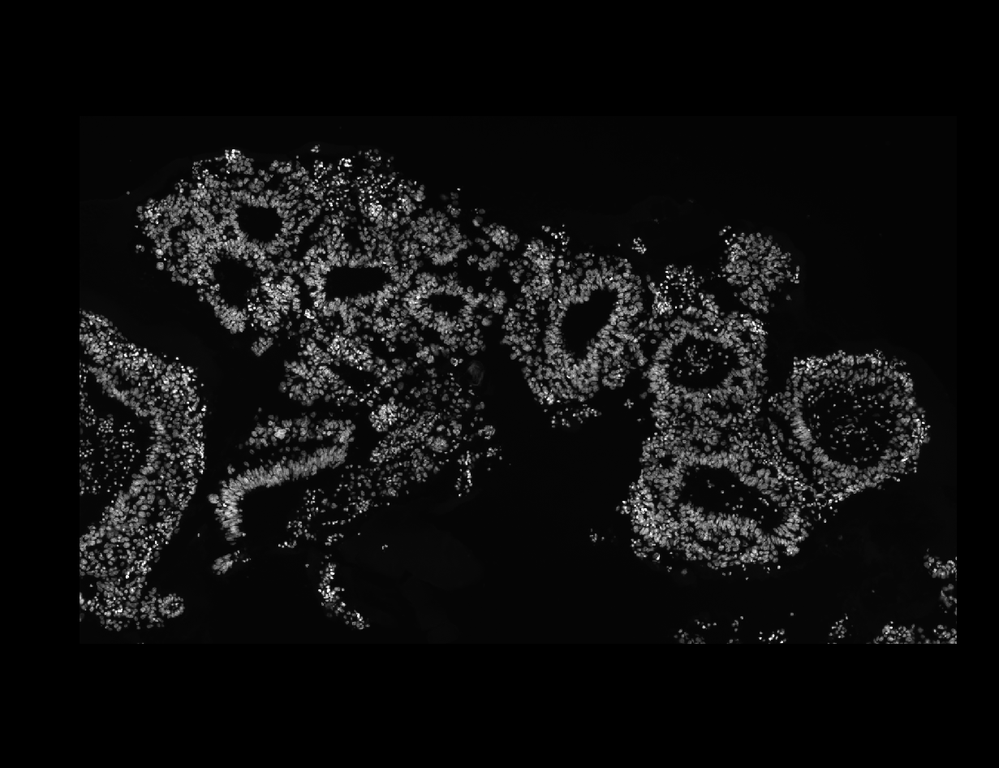
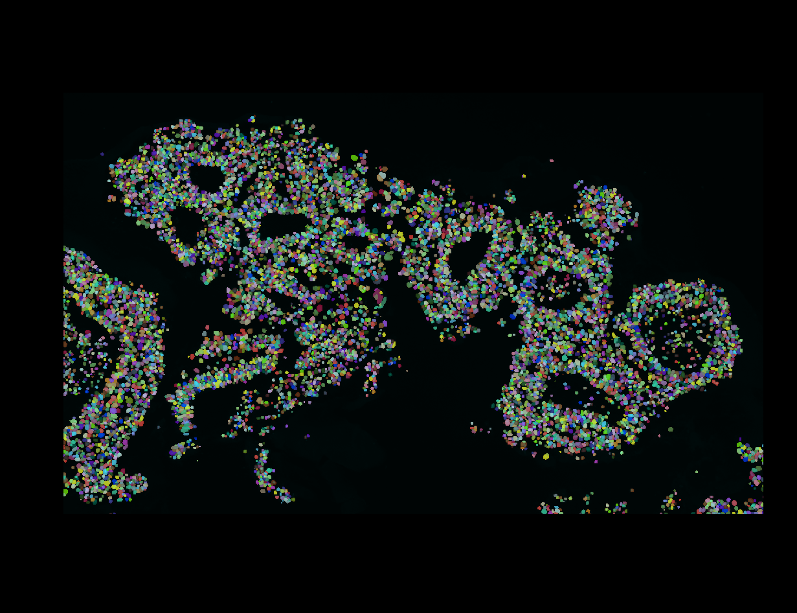

# **Entrenaminento en analisis de imagenes t-CyCIF**

Instructora: [Angela Zsabo](https://www.linkedin.com/in/ang%C3%A9la-szab%C3%B3-27321a125/)

Este analsis esta basado en el [repostorio](https://github.com/CruzOsuna/BMF_t-CyCIF/tree/main)  de Cruz y en el de [image_processing](https://github.com/CruzOsuna/BMF_t-CyCIF/tree/main) de [Färkkilä Lab](https://github.com/farkkilab). 

Las imagenes analizadas corresponden al proyecto de Ovarian & Brast Cancer. Para el entrenamiento se usaron los archivos disponibles en esta ruta: 

        \\NAS_BMF_LAB\Projects\t-CycIF\t-CycIF_MX\ovarian_and_breast\czi_5_cycles\BC577_20_1_5_cycles

Las muestras son: 

        BC577_20_1_041225_5_SLIDES_CICLO_1.czi  
        BC577_20_1_041225_5_SLIDES_CICLO_3.czi  
        BC577_20_1_041225_5_SLIDES_CICLO_5.czi
        BC577_20_1_041225_5_SLIDES_CICLO_2.czi  
        BC577_20_1_041225_5_SLIDES_CICLO_4.czi  
        BC577_20_1_041225_5_SLIDES_CICLO_6.czi

### Illumination Correction

Pasos previos: instalar docker y crear la imagen conforme a lo indicado en el 
[repositorio](https://github.com/CruzOsuna/BMF_t-CyCIF/tree/main/Processing_Stable/00_Illumination_correction) de Cruz. Para que funcione con WSL es necesario tener abierta la app dw Docker Desktop en Windows. 

* Para evitar correr sudo en cada comando de Docker:

        sudo usermod -aG docker $USER

* Restaurar sesion para que se apliquen los cambios de Docker.

        newgrp docker

*  Verificar que Docker funciona

        docker run hello-world
    
* Construir la imagen de Docker **en la carpeta Scripts, aqui se encuentra el Docker file** dentro de la estructura del repositorio de Cruz: /BMF_t-CyCIF/Processing_Stable/00_Illumination_correction/Scripts
        
        docker build -t mybasic-image .

+ Si la imagen ya esta creada entonces ejecutar enn la carpeta donde se raliza el analisis:

        docker run -it -v $(pwd):/data mybasic-image bash

+ Si se ejecuto correctamente habra un cambio en el promt indicando que nos ubicamos en el contenedor:

        fiji@9a0007129014:/opt/fiji$

* Correr en el contenedor modificando recursos computacionales:

        sudo docker run --privileged -it -m 20g --cpus=8 \
        --mount type=bind,source="$(pwd)",target=/data mybasic-image bash

* Dentro de contenedor ir a data:

    cd /data

Debe existir el directorio *input* y *output*. Las imagenes a analizar deberan estra en un subdirectorio en *input*. **Este paso se corre dentro del repositorio de Cruz.**

* Ejecutar el analsiis:

        bash BaSiC_run.sh

Al final el difrectorio con los resultados en *output* se ve asi:

        (base) jrmarval@BMFLAB:~/cycif/training$ tree
        .
        ├── BaSiC_run.sh
        ├── Dockerfile
        ├── imagej_basic_ashlar.py
        ├── imagej_basic_ashlar_filepattern.py
        ├── input
        │   └── BC577_20_1_5_cycles
        │       ├── BC577_20_1_041225_5_SLIDES_CICLO_1.czi
        │       ├── BC577_20_1_041225_5_SLIDES_CICLO_2.czi
        │       ├── BC577_20_1_041225_5_SLIDES_CICLO_3.czi
        │       ├── BC577_20_1_041225_5_SLIDES_CICLO_4.czi
        │       ├── BC577_20_1_041225_5_SLIDES_CICLO_5.czi
        │       └── BC577_20_1_041225_5_SLIDES_CICLO_6.czi
        ├── live_progress_monitor.sh
        └── output
        └── BC577_20_1_5_cycles
                ├── BC577_20_1_041225_5_SLIDES_CICLO_1.czi-dfp.tif
                ├── BC577_20_1_041225_5_SLIDES_CICLO_1.czi-ffp.tif
                ├── BC577_20_1_041225_5_SLIDES_CICLO_2.czi-dfp.tif
                ├── BC577_20_1_041225_5_SLIDES_CICLO_2.czi-ffp.tif
                ├── BC577_20_1_041225_5_SLIDES_CICLO_3.czi-dfp.tif
                ├── BC577_20_1_041225_5_SLIDES_CICLO_3.czi-ffp.tif
                ├── BC577_20_1_041225_5_SLIDES_CICLO_4.czi-dfp.tif
                ├── BC577_20_1_041225_5_SLIDES_CICLO_4.czi-ffp.tif
                ├── BC577_20_1_041225_5_SLIDES_CICLO_5.czi-dfp.tif
                ├── BC577_20_1_041225_5_SLIDES_CICLO_5.czi-ffp.tif
                ├── BC577_20_1_041225_5_SLIDES_CICLO_6.czi-dfp.tif
                └── BC577_20_1_041225_5_SLIDES_CICLO_6.czi-ffp.tif

        5 directories, 23 files

*Nota:* estas meustras se conforman de 6 ciclos y 4 canales. 

### **Registration: Stitching**

El codigo empleado para ejecutar este paso se basa en el repostorio de [farkkilab](https://github.com/farkkilab/image_processing/blob/main/pipeline/1_stitching/ashlar_workflow.py)
solo se modifcaron las rutas en nuestra computadora, muy similar a lo que indica el repositorio de Cruz.

Primero hay que crear el entorno conda:

        conda env create -f image_registration.yml
---
        conda activate image_registration
---

Posteriormente se verifica la ubicacion y version de Ashlar:

        which ashlar
---
        > /home/jrmarval/miniconda3/envs/image_registration/bin/ashlar
---
        conda list
---
        > ashlar                       1.17.0           pypi_0                    pypi
---

Las rutas a modificar son estas y estan en el archivo **ashlar_processing.py**: 

        my_path = "/home/jrmarval/cycif/training/input/illumination_correction"
        output_path = "/home/jrmarval/cycif/training/output/illumination_correction"
        subfolders = [ f.path for f in os.scandir(my_path) if f.is_dir() ]
        file_type = 'czi' # 'nd2' 'rcpnl'
        illumination = 'Y' # 'N' 'Y'
        illumination_folder = "/home/jrmarval/cycif/training/output/illumination_correction"

Posteriormente ejecute el script ashlar_processing.py equivalente a stitching.py. Hice una variante para saber cuanto tarda en ejecutarse este proceso medinate un temporizador en un **script de bash (run_ashlar.sh)** ejecutado en segundo plano:

        #!/bin/bash

        # Star timer
        start_time=$(date +%s.%N)

        # Run script ashlar
        python ashlar_processing.py -c 8

        # Execution time 
        end_time=$(date +%s.%N)
        execution_time=$(echo "$end_time - $start_time" | bc)

        # Convert seconds to minutes>seconds
        minutes=$(echo "scale=0; $execution_time / 60" | bc)
        seconds=$(echo "scale=0; $execution_time % 60" | bc)
        total_minutes=$(echo "$minutes + ($seconds > 0)" | bc)

        echo "Script Done"
        echo "Execution time: $minutes minutes $seconds seconds"
        echo

        # Alert by mail
        # Body mail
        BODY="Script done in: ${total_minutes} minutes."

        # Send mail
        echo "$BODY" | mail -s "Notice: Job Done" jhonatanraulm@gmail.com

        # End 
        echo "Done"

La estructura final del repositorio es la siguiente:

        (image_registration) jrmarval@BMFLAB:~/cycif/training$ tree
        .
        ├── ashlar_processing.py
        ├── illumination_correction
        │   ├── BaSiC_run.sh
        │   ├── Dockerfile
        │   ├── imagej_basic_ashlar.py
        │   ├── imagej_basic_ashlar_filepattern.py
        │   └── live_progress_monitor.sh
        ├── input
        │   └── illumination_correction
        │       └── BC577_20_1_5_cycles
        │           ├── BC577_20_1_041225_5_SLIDES_CICLO_1.czi
        │           ├── BC577_20_1_041225_5_SLIDES_CICLO_2.czi
        │           ├── BC577_20_1_041225_5_SLIDES_CICLO_3.czi
        │           ├── BC577_20_1_041225_5_SLIDES_CICLO_4.czi
        │           ├── BC577_20_1_041225_5_SLIDES_CICLO_5.czi
        │           └── BC577_20_1_041225_5_SLIDES_CICLO_6.czi
        ├── nohup.out
        ├── output
        │   └── illumination_correction
        │       ├── BC577_20_1_5_cycles
        │       │   ├── BC577_20_1_041225_5_SLIDES_CICLO_1.czi-dfp.tif
        │       │   ├── BC577_20_1_041225_5_SLIDES_CICLO_1.czi-ffp.tif
        │       │   ├── BC577_20_1_041225_5_SLIDES_CICLO_2.czi-dfp.tif
        │       │   ├── BC577_20_1_041225_5_SLIDES_CICLO_2.czi-ffp.tif
        │       │   ├── BC577_20_1_041225_5_SLIDES_CICLO_3.czi-dfp.tif
        │       │   ├── BC577_20_1_041225_5_SLIDES_CICLO_3.czi-ffp.tif
        │       │   ├── BC577_20_1_041225_5_SLIDES_CICLO_4.czi-dfp.tif
        │       │   ├── BC577_20_1_041225_5_SLIDES_CICLO_4.czi-ffp.tif
        │       │   ├── BC577_20_1_041225_5_SLIDES_CICLO_5.czi-dfp.tif
        │       │   ├── BC577_20_1_041225_5_SLIDES_CICLO_5.czi-ffp.tif
        │       │   ├── BC577_20_1_041225_5_SLIDES_CICLO_6.czi-dfp.tif
        │       │   └── BC577_20_1_041225_5_SLIDES_CICLO_6.czi-ffp.tif
        │       └── BC577_20_1_5_cycles.ome.tif
        ├── run_ashlar.sh
        └── stitching_czi.py

        8 directories, 28 files

        El rsultado de este paso es el archivo: **BC577_20_1_5_cycles.ome.tif**

### **Visualization**

El programa a utlizar es Napari. Para ello seguiremos las instrucciones del [repositorio](https://github.com/CruzOsuna/BMF_t-CyCIF/tree/main/Processing_Stable/02_Visualization) de Cruz. 

+ El primer paso es crear un ambiewnte Conda:

        conda env create -f napari-env.yml

+ Activar el ambiente:

        conda activate napari-env

+ Para correr el notebook:

        code Napari.ipynb

Se ejecutan las celdas presentes recordadno seleccionar el kernel de Python correspondiente a nuestro entorno Conda.

### **Segmentation** 

Las indicaciones de Angela fueron realizar este proceso con Mesmer. El uso previo de esta herramienta demostro un mejor rendiemiento sobre el tipo de muestars que se trabajan en el BMF&CL. Para correr Mesmer es necesario contar con *DeepCell API key: DeepCell_API_key.txt*.

+ Posteriormente se crea un ambiente Conda:

        conda create -n mesmer_env python=3.9.25

+ Activar em ambiente:

        conda activate mesmer_env

El ambiente se encuentra en el archivo: mesmer.yml

        conda env create -f mesmer.yml

Posterior a esto, se ejecutan las celdas de notebook *mesmer_segmentation_cropped.ipynb*.

**Este proceso corre con GPU**, para hacer la configuracion necesaria se ejecuto el script *install_mesmer_gpu.sh*:

        #!/bin/bash

        echo "🚀 Instalación Mesmer GPU - Método Conda Completo"
        echo "===================================================="

        # Asegurarse de que conda está disponible
        eval "$(conda shell.bash hook)"

        # Activar entorno
        conda activate mesmer

        # Instalar CUDA desde conda
        echo ""
        echo "📦 Instalando CUDA Toolkit 11.8..."
        conda install -c conda-forge cudatoolkit=11.8.0 -y

        echo ""
        echo "📦 Instalando cuDNN 8.9..."
        conda install -c conda-forge cudnn=8.9.2.26 -y

        # Configurar variables de entorno
        echo ""
        echo "⚙️  Configurando variables de entorno..."
        mkdir -p $CONDA_PREFIX/etc/conda/activate.d

        cat > $CONDA_PREFIX/etc/conda/activate.d/env_vars.sh << 'EOF'
        #!/bin/bash
        export LD_LIBRARY_PATH=$CONDA_PREFIX/lib:$LD_LIBRARY_PATH
        export CUDA_HOME=$CONDA_PREFIX
        export PATH=$CONDA_PREFIX/bin:$PATH
        EOF

        chmod +x $CONDA_PREFIX/etc/conda/activate.d/env_vars.sh

        # Reactivar
        conda deactivate
        conda activate mesmer

        # Verificar instalación de librerías
        echo ""
        echo "🔍 Verificando librerías CUDA instaladas..."
        if ls $CONDA_PREFIX/lib/libcudart.so* 1> /dev/null 2>&1; then
        echo "✅ libcudart encontrada"
        else
        echo "❌ libcudart NO encontrada"
        fi

        if ls $CONDA_PREFIX/lib/libcudnn.so* 1> /dev/null 2>&1; then
        echo "✅ libcudnn encontrada"
        else
        echo "❌ libcudnn NO encontrada"
        fi

        # Reinstalar TensorFlow
        echo ""
        echo "🧠 Instalando TensorFlow 2.12..."
        pip uninstall tensorflow tensorflow-gpu -y 2>/dev/null
        pip install tensorflow==2.12.0

        # Instalar DeepCell y dependencias
        echo ""
        echo "🧬 Instalando DeepCell..."
        pip install deepcell

        echo ""
        echo "📚 Instalando dependencias..."
        pip install tifffile opencv-python-headless scikit-image matplotlib scikit-learn pillow

        # Jupyter
        echo ""
        echo "📓 Configurando Jupyter..."
        pip install jupyter jupyterlab ipykernel ipywidgets
        python -m ipykernel install --user --name=mesmer --display-name "Python 3.9 (Mesmer GPU)"

        # Test final
        echo ""
        echo "===================================================="
        echo "🧪 VERIFICACIÓN FINAL"
        echo "===================================================="

        python << 'PYEOF'
        import os
        os.environ['TF_CPP_MIN_LOG_LEVEL'] = '2'

        import tensorflow as tf

        print(f"\n✅ TensorFlow: {tf.__version__}")
        print(f"✅ CUDA build: {tf.test.is_built_with_cuda()}")

        gpus = tf.config.list_physical_devices('GPU')
        print(f"\n🎮 GPUs detectadas: {len(gpus)}")

        if gpus:
        for gpu in gpus:
                print(f"   └─ {gpu.name}")
                tf.config.experimental.set_memory_growth(gpu, True)
        print("\n✅ GPU FUNCIONANDO CORRECTAMENTE! 🎉")
        else:
        print("\n⚠️  No se detectaron GPUs")
        print("Revisa las variables de entorno:")
        print(f"   LD_LIBRARY_PATH: {os.environ.get('LD_LIBRARY_PATH', 'NO DEFINIDO')[:80]}...")
        PYEOF

        echo ""
        echo "===================================================="
        echo "✅ INSTALACIÓN COMPLETA"
        echo "===================================================="
        echo ""
        echo "📝 Para usar:"
        echo "   conda activate mesmer"
        echo "   jupyter lab --no-browser"
        echo ""

Para recortar la imagen segui el codigo en Python de Angela, y solo adapte las coordedas de la imagen:

        # Importar libreria
        import tifffile as tif

        # Ruta a la imagen a recortar
        image = tif.imread("/home/jrmarval/cycif/training/output/illumination_correction/BC577_20_1_5_cycles.ome.tif")

        # Dimensiones de la imagen
        image.shape
                > (21, 16133, 33443)

        # Ejemplo de como cortaron Angela y Luis
        image_crop=image[:,5945:9024,18519:23885]

        # Crop con cuadrado en Napari es importante reconocer X & Y: image[:, y_min:y_max, x_min:x_max]
        cropped = image[:, 6378:7385, 7676:9350]
        tif.imwrite("/home/jrmarval/cycif/training/output/illumination_correction/image_cropped.tif", cropped)

Nota: el scrip original no funcional con la imagen recortada.

El resultado luce asi:

---
